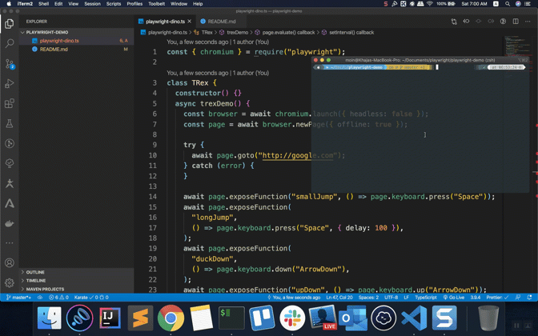

# Playright-Google-Dino

This is a demo of Playwright automating the Google Dino game

### Pre-requisites

- Install Nodejs LTS version from [here](https://nodejs.org/en/download/)
- Install Playwright globally running the command `npm i -g playwright`

### Play the game

- Open a terminal window and cd to the <b>PLAYWRIGHT-DEMO</b> folder
- Run the command `node playwright-dino.ts`

### Game Demo

### Resources

- [Chromium offline source code](https://source.chromium.org/chromium/chromium/src/+/master:components/neterror/resources/offline.js?originalUrl=https:%2F%2Fcs.chromium.org%2F)
